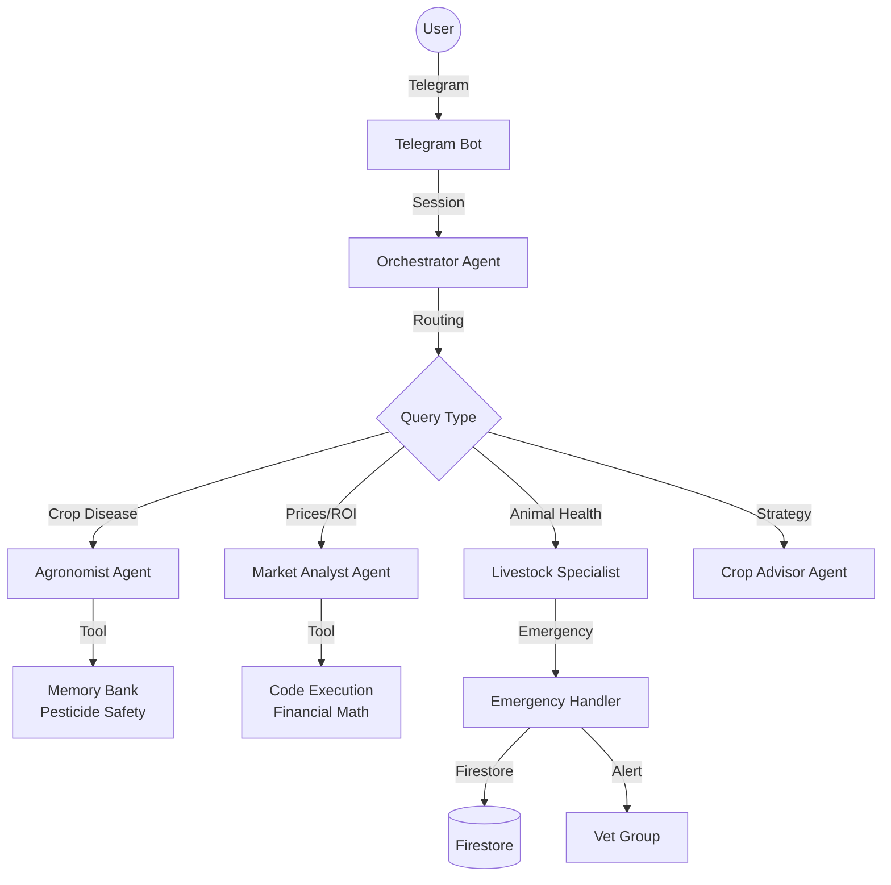
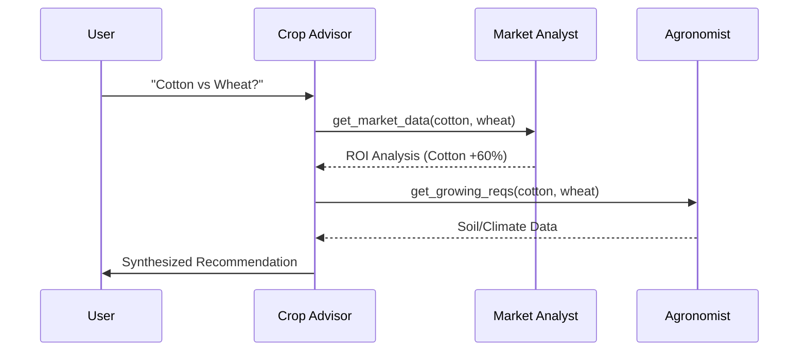
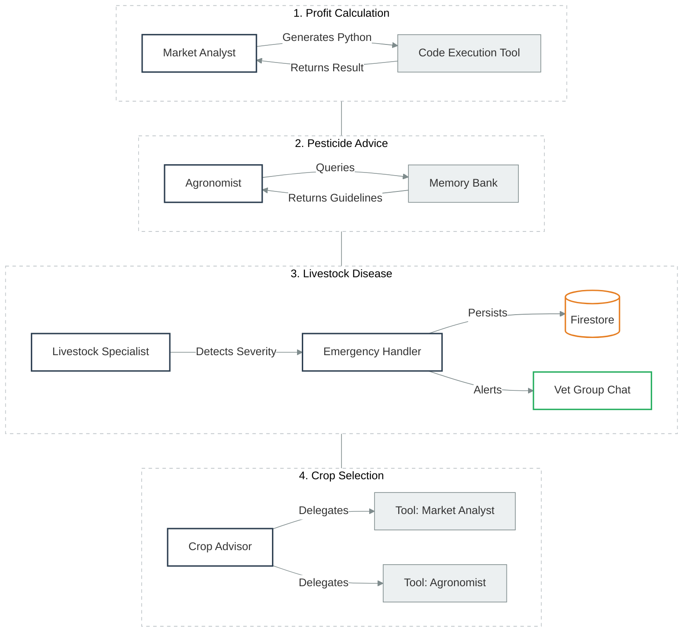

# FarmFlow: AI-Powered Agricultural Assistant
**Track:** Agents for Good

## Problem
Smallholder farmers often lack access to timely, expert advice. Critical decisions about crop selection, pest management, and livestock health are often made with incomplete information, leading to financial loss and food insecurity. Traditional extension services are resource-constrained and cannot provide 24/7 personalized support.

## Solution
FarmFlow is a multi-agent AI system accessible via Telegram, the platform farmers already use. It orchestrates specialized AI agents to provide expert-level guidance on agronomy, market economics, and veterinary care. Unlike simple chatbots, FarmFlow uses a **Human-in-the-Loop** architecture for critical emergencies and **Agent-to-Agent (A2A)** protocols for complex decision-making.

## Architecture

### High-Level System Design
The system uses a hub-and-spoke architecture where an **Orchestrator Agent** routes user queries to specialized agents.



## Key Technical Features

### 1. Agent-to-Agent (A2A) Protocol
For complex strategic questions (e.g., "Should I plant cotton or wheat?"), a single agent is insufficient. We implemented an **A2A** pattern where the `Crop Advisor` acts as a manager, delegating sub-tasks to other agents.

*   **Scenario**: User asks for a crop recommendation.
*   **Flow**:
    1.  `Crop Advisor` receives the query.
    2.  Calls `Market Analyst` (via tool) to get current prices and ROI.
    3.  Calls `Agronomist` (via tool) to check soil/climate suitability.
    4.  Synthesizes both responses into a final recommendation.



### 2. Tools & Code Execution
LLMs are notoriously bad at math. To ensure accurate financial advice, the `Market Analyst` agent does not calculate ROI in its head. Instead, it uses a **Code Execution Tool** (Python REPL) to perform arithmetic operations, ensuring 100% accuracy for profit/loss projections.

### 3. Human-in-the-Loop (Emergency Escalation)
AI should not handle life-or-death situations alone. We implemented a robust escalation flow for livestock emergencies.

*   **Detection**: The `Livestock Specialist` analyzes queries for severity markers (e.g., "bleeding", "not eating").
*   **Persistence**: Emergency cases are stored in **Google Cloud Firestore** to ensure state survives container restarts.
*   **Escalation**: High-severity cases are automatically posted to a dedicated **Vet Group** on Telegram.
*   **Feedback Loop**: When a human vet replies in the group, the bot polls the update, matches it to the case ID, and forwards the expert advice back to the farmer.

### 4. Memory & Context Management
*   **Memory Bank**: The `Agronomist` agent has access to a static "Memory Bank" of pesticide safety guidelines, ensuring it always provides safe chemical handling advice without hallucinations.
*   **Context Compaction**: To handle long conversations without hitting token limits or confusing the model, the `Market Analyst` uses **Context Compaction**, summarizing older turns while keeping recent financial context intact.

### 5. Deployment & Observability
*   **Compute**: Google Cloud Run (Serverless).
*   **Mode**: Webhooks (for low latency and scalability).
*   **Database**: Firestore (Native Mode).
*   **Observability**: All agent activities, tool calls, and routing decisions are logged to **Cloud Logging** using structured JSON logs.

## Tool Usage & Scenarios
The following diagram illustrates how different agents leverage specific tools to solve distinct user problems.



## Evaluations
We used `google-adk` to rigorously evaluate our agents before deployment.
*   **Rubrics**: Defined specific criteria (e.g., "Financial Accuracy", "Safety Compliance").
*   **EvalSets**: Created dataset of test cases (`evals/data/`).
*   **Results**:
    *   Market Analyst: **PASSED** (Verified math accuracy).
    *   Agronomist: **PASSED** (Verified safety guidelines).
    *   Crop Advisor (A2A): **PASSED** (Verified tool usage and synthesis).

## Setup & Reproduction

### Prerequisites
*   Python 3.11+
*   Google Cloud Project with Vertex AI enabled
*   Telegram Bot Token

### Local Development
1.  Clone the repository.
2.  Install dependencies: `pip install -r requirements.txt`
3.  Set environment variables in `.env`:
    ```bash
    TELEGRAM_TOKEN=your_main_bot_token
    TELEGRAM_TOKEN_EMERGENCY_BOT=your_emergency_bot_token
    GOOGLE_API_KEY=your_gemini_key
    GOOGLE_CLOUD_PROJECT=your_project
    GOOGLE_CLOUD_LOCATION=us-central1
    VET_GROUP_CHAT_ID=-100xxxxxxxxx  # Group ID for vet alerts
    GOOGLE_GENAI_USE_VERTEXAI=true
    AGENT_ENGINE_ID=your_agent_engine_id
    ```
4.  Run the bot: `python telegram_bot.py`

### Cloud Deployment
1.  **Build**: `gcloud builds submit --tag gcr.io/PROJECT_ID/farmflow`
2.  **Deploy**:
    ```bash
    gcloud run deploy farmflow \
      --image gcr.io/PROJECT_ID/farmflow \
      --set-env-vars "MODE=WEBHOOK,WEBHOOK_URL=https://your-service-url" \
      --set-env-vars "TELEGRAM_TOKEN=...,TELEGRAM_TOKEN_EMERGENCY_BOT=..." \
      --set-env-vars "GOOGLE_API_KEY=...,GOOGLE_CLOUD_PROJECT=..." \
      --set-env-vars "VET_GROUP_CHAT_ID=...,GOOGLE_GENAI_USE_VERTEXAI=true"
    ```
